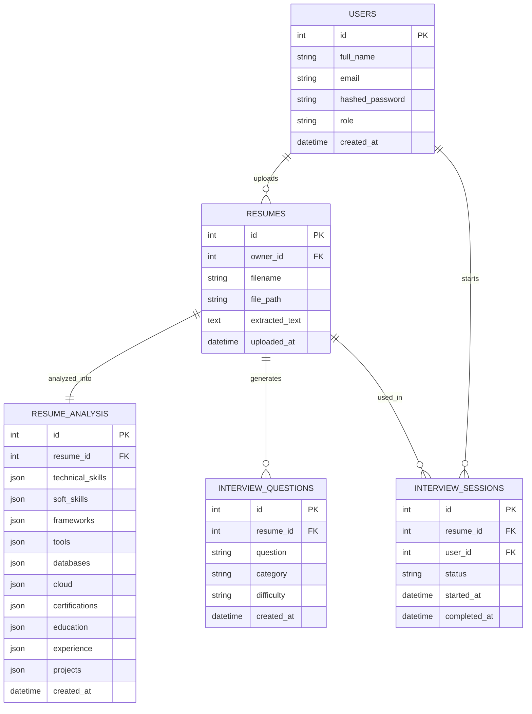

# SmartHire AI – Entity Relationship Diagram

The following ER diagram represents the database schema implemented up to **Milestone 2 (Resume Parsing & AI Interview Engine)**.

## ER Diagram

---

# Relationship Summary

## Users → Resumes

Relationship:
**One-to-Many**

A candidate can upload multiple resumes.

---

## Resumes → Resume Analysis

Relationship:
**One-to-One**

Each resume has one AI-generated resume analysis containing extracted skills, education, experience, certifications, and projects.

---

## Resumes → Interview Questions

Relationship:
**One-to-Many**

AI generates multiple interview questions from a resume.

---

## Users → Interview Sessions

Relationship:
**One-to-Many**

A user can attempt multiple mock interviews.

---

## Resumes → Interview Sessions

Relationship:
**One-to-Many**

Different interview sessions can be created for the same uploaded resume.

---

# Database Status

Implemented through Milestone 2:

- ✅ Users
- ✅ Resumes
- ✅ Resume Analysis
- ✅ Interview Questions
- ✅ Interview Sessions

---

# Planned for Future Milestones

The following entities will be introduced in upcoming milestones:

- Jobs
- Applications
- Interview Responses
- Speech Analysis
- Emotion Detection
- Eye Contact Tracking
- AI Feedback Reports
- Recruiter Analytics
- Notifications
- Performance Reports

These entities are intentionally excluded from the current ER diagram because they are not yet implemented.