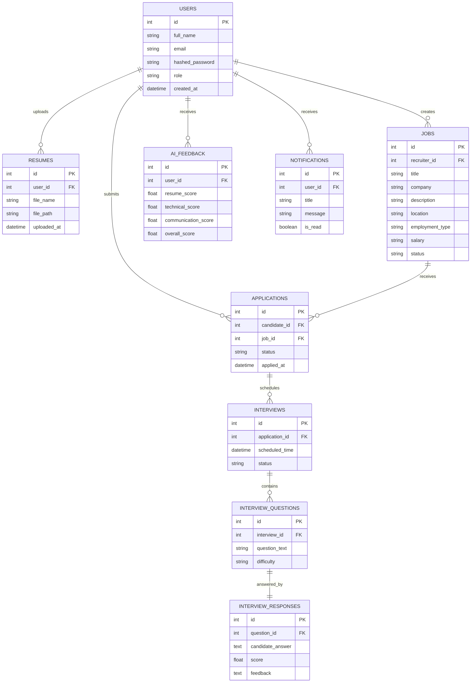

# SmartHire AI - Entity Relationship Diagram

```mermaid
erDiagram

    USERS ||--o{ RESUMES : uploads
    USERS ||--o{ JOBS : creates
    USERS ||--o{ APPLICATIONS : submits
    USERS ||--o{ AI_FEEDBACK : receives
    USERS ||--o{ NOTIFICATIONS : receives

    JOBS ||--o{ APPLICATIONS : receives

    APPLICATIONS ||--o{ INTERVIEWS : schedules

    INTERVIEWS ||--o{ INTERVIEW_QUESTIONS : contains

    INTERVIEW_QUESTIONS ||--|| INTERVIEW_RESPONSES : answered_by

    USERS {
        int id PK
        string full_name
        string email
        string hashed_password
        string role
        datetime created_at
    }

    RESUMES {
        int id PK
        int user_id FK
        string file_name
        string file_path
        datetime uploaded_at
    }

    JOBS {
        int id PK
        int recruiter_id FK
        string title
        string company
        string description
        string location
        string employment_type
        string salary
        string status
    }

    APPLICATIONS {
        int id PK
        int candidate_id FK
        int job_id FK
        string status
        datetime applied_at
    }

    INTERVIEWS {
        int id PK
        int application_id FK
        datetime scheduled_time
        string status
    }

    INTERVIEW_QUESTIONS {
        int id PK
        int interview_id FK
        string question_text
        string difficulty
    }

    INTERVIEW_RESPONSES {
        int id PK
        int question_id FK
        text candidate_answer
        float score
        text feedback
    }

    AI_FEEDBACK {
        int id PK
        int user_id FK
        float resume_score
        float technical_score
        float communication_score
        float overall_score
    }

    NOTIFICATIONS {
        int id PK
        int user_id FK
        string title
        string message
        boolean is_read
    }
```