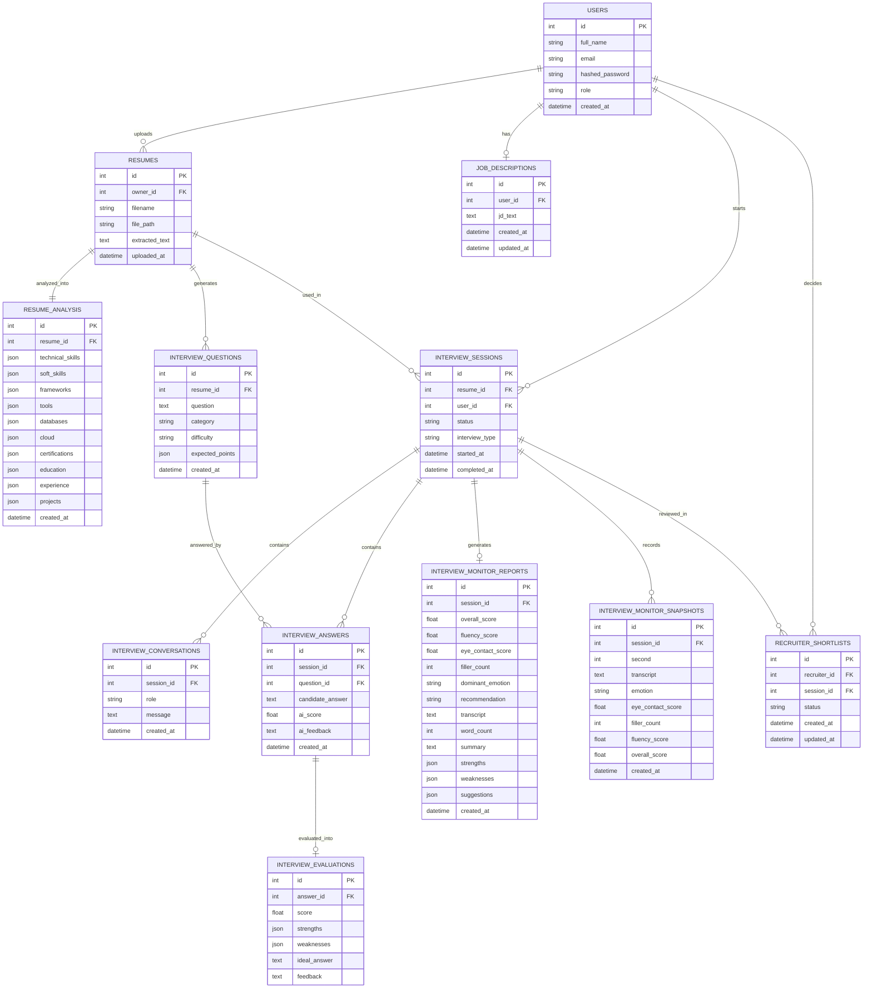

# SmartHire AI – Entity Relationship Diagram

The following Entity Relationship Diagram (ERD) represents the **complete database schema implemented in SmartHire AI**.

The schema includes user management, resume management, AI resume analysis, Job Description management, interview question generation, conversational interviews, candidate answer evaluation, real-time interview monitoring, analytics snapshots, and recruiter shortlisting.

---

# ER Diagram

```mermaid
erDiagram

    USERS ||--o{ RESUMES : uploads
    USERS ||--o| JOB_DESCRIPTIONS : has
    USERS ||--o{ INTERVIEW_SESSIONS : starts
    USERS ||--o{ RECRUITER_SHORTLISTS : decides

    RESUMES ||--|| RESUME_ANALYSIS : analyzed_into
    RESUMES ||--o{ INTERVIEW_QUESTIONS : generates
    RESUMES ||--o{ INTERVIEW_SESSIONS : used_in

    INTERVIEW_SESSIONS ||--o{ INTERVIEW_CONVERSATIONS : contains
    INTERVIEW_SESSIONS ||--o{ INTERVIEW_ANSWERS : contains
    INTERVIEW_SESSIONS ||--o| INTERVIEW_MONITOR_REPORTS : generates
    INTERVIEW_SESSIONS ||--o{ INTERVIEW_MONITOR_SNAPSHOTS : records
    INTERVIEW_SESSIONS ||--o{ RECRUITER_SHORTLISTS : reviewed_in

    INTERVIEW_QUESTIONS ||--o{ INTERVIEW_ANSWERS : answered_by
    INTERVIEW_ANSWERS ||--o| INTERVIEW_EVALUATIONS : evaluated_into

    USERS {
        int id PK
        string full_name
        string email
        string hashed_password
        string role
        datetime created_at
    }

    RESUMES {
        int id PK
        int owner_id FK
        string filename
        string file_path
        text extracted_text
        datetime uploaded_at
    }

    RESUME_ANALYSIS {
        int id PK
        int resume_id FK
        json technical_skills
        json soft_skills
        json frameworks
        json tools
        json databases
        json cloud
        json certifications
        json education
        json experience
        json projects
        datetime created_at
    }

    JOB_DESCRIPTIONS {
        int id PK
        int user_id FK
        text jd_text
        datetime created_at
        datetime updated_at
    }

    INTERVIEW_QUESTIONS {
        int id PK
        int resume_id FK
        text question
        string category
        string difficulty
        json expected_points
        datetime created_at
    }

    INTERVIEW_SESSIONS {
        int id PK
        int resume_id FK
        int user_id FK
        string status
        string interview_type
        datetime started_at
        datetime completed_at
    }

    INTERVIEW_CONVERSATIONS {
        int id PK
        int session_id FK
        string role
        text message
        datetime created_at
    }

    INTERVIEW_ANSWERS {
        int id PK
        int session_id FK
        int question_id FK
        text candidate_answer
        float ai_score
        text ai_feedback
        datetime created_at
    }

    INTERVIEW_EVALUATIONS {
        int id PK
        int answer_id FK
        float score
        json strengths
        json weaknesses
        text ideal_answer
        text feedback
    }

    INTERVIEW_MONITOR_REPORTS {
        int id PK
        int session_id FK
        float overall_score
        float fluency_score
        float eye_contact_score
        int filler_count
        string dominant_emotion
        string recommendation
        text transcript
        int word_count
        text summary
        json strengths
        json weaknesses
        json suggestions
        datetime created_at
    }

    INTERVIEW_MONITOR_SNAPSHOTS {
        int id PK
        int session_id FK
        int second
        text transcript
        string emotion
        float eye_contact_score
        int filler_count
        float fluency_score
        float overall_score
        datetime created_at
    }

    RECRUITER_SHORTLISTS {
        int id PK
        int recruiter_id FK
        int session_id FK
        string status
        datetime created_at
        datetime updated_at
    }
```

---

# Relationship Summary

## Users to Resumes

**One-to-Many.** A registered user can upload multiple resumes. Each resume belongs to one user.

## Users to Job Descriptions

**One-to-One / Optional.** A user can store at most one Job Description for Resume–JD matching and interview personalization.

## Users to Interview Sessions

**One-to-Many.** A candidate can participate in multiple interview sessions.

## Users to Recruiter Shortlists

**One-to-Many.** A recruiter can create multiple shortlist records for different interview sessions.

## Resumes to Resume Analysis

**One-to-One.** Each resume has at most one AI-generated resume analysis.

## Resumes to Interview Questions

**One-to-Many.** Multiple interview questions can be generated from a single resume.

## Resumes to Interview Sessions

**One-to-Many.** A resume can be used in multiple interview sessions.

## Interview Sessions to Interview Conversations

**One-to-Many.** Each interview session can contain multiple conversational messages.

## Interview Sessions to Interview Answers

**One-to-Many.** Each interview session can contain multiple candidate answers.

## Interview Questions to Interview Answers

**One-to-Many.** An interview question can be referenced by multiple answers across interview sessions.

## Interview Answers to Interview Evaluations

**One-to-One / Optional.** Each interview answer can have at most one detailed AI evaluation.

## Interview Sessions to Interview Monitor Reports

**One-to-One / Optional.** Each completed interview session can have at most one final monitoring report.

## Interview Sessions to Interview Monitor Snapshots

**One-to-Many.** Multiple monitoring snapshots can be recorded during an interview session for timeline-based analytics.

## Interview Sessions to Recruiter Shortlists

**One-to-Many.** An interview session can be referenced by multiple recruiter shortlist records, allowing different recruiters to make independent decisions.

---

# Current Database Tables

| Table | Status |
|---|---|
| Users | Implemented |
| Resumes | Implemented |
| Resume Analysis | Implemented |
| Job Descriptions | Implemented |
| Interview Questions | Implemented |
| Interview Sessions | Implemented |
| Interview Conversations | Implemented |
| Interview Answers | Implemented |
| Interview Evaluations | Implemented |
| Interview Monitor Reports | Implemented |
| Interview Monitor Snapshots | Implemented |
| Recruiter Shortlists | Implemented |

---

# Database Highlights

The current database supports:

- Secure user authentication
- Role-Based Access Control
- Candidate, recruiter, and admin roles
- Resume management
- AI-powered resume analysis
- Job Description storage
- Resume–JD matching support
- Interview type selection (`hr`, `technical`, `managerial`)
- Conversational interview history
- Interview session management
- Candidate answer storage
- AI answer evaluation
- Speech-to-text transcript storage
- Emotion detection
- Eye-contact analysis
- Filler-word detection
- Fluency analysis
- AI-generated monitoring reports
- Timeline-based analytics snapshots
- Recruiter shortlisting
- Referential integrity
- Cascade-aware data deletion

---

# Database Status

**Current Version:** Complete platform schema (hybrid deployment)

| Layer | Status |
|---|---|
| Relational schema | Complete |
| Frontend | Deployed on Vercel |
| Backend API | Local FastAPI |
| Database host | Local PostgreSQL |
| Public API access | ngrok tunnel |

## Completed Components

- Authentication system
- Role-Based Access Control
- Resume management
- AI resume analysis
- Job Description management
- Resume–JD matching support
- Interview type support
- Conversational interview tracking
- Interview session tracking
- Candidate answer storage
- AI answer evaluation
- Speech-to-text analysis
- Emotion recognition
- Eye-contact detection
- Filler-word analysis
- Fluency scoring
- Interview monitoring
- Interview analytics
- Recruiter shortlist workflow

## Optional Next Step

- Host PostgreSQL and the API on a cloud provider so the database and backend remain available without depending on the developer machine.

---

# Database Architecture

The SmartHire AI database architecture provides a normalized, scalable, and referentially consistent foundation for AI-powered recruitment workflows.

The ERD separates major system entities into independent tables and connects them with primary and foreign keys. One-to-one, one-to-many, and optional relationships match the implemented structure.

The architecture supports the full path from registration and resume processing to AI interviews, evaluation, real-time monitoring, analytics, and recruiter decisions.

---

# Design Principles

- **Normalized** — Third Normal Form (3NF) principles
- **Modular** — Dedicated tables for major business entities
- **Scalable** — Ready for additional recruitment and AI features
- **Referentially consistent** — Foreign keys maintain valid relationships
- **Maintainable** — SQLAlchemy ORM and Alembic migrations
- **Extensible** — New modules can be added without major redesign
- **Cloud-ready** — Schema can move to managed PostgreSQL without redesign

---

# Conclusion

The SmartHire AI Entity Relationship Diagram describes the complete relational architecture of the platform.

It links user management, resume processing, AI analysis, Job Description management, interview generation, conversational interviews, answer evaluation, real-time monitoring, analytics, and recruiter shortlisting in one coherent structure.

Data integrity is maintained through primary keys, foreign keys, unique constraints, and application-level validation, providing a solid base for the current hybrid deployment and for a future fully cloud-hosted stack.