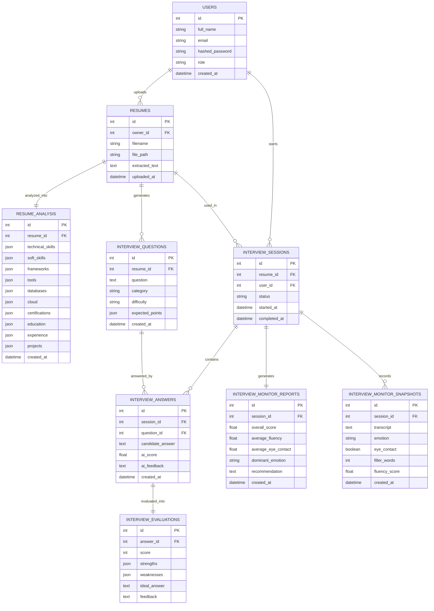

# SmartHire AI – Entity Relationship Diagram

The following Entity Relationship Diagram (ERD) represents the database schema implemented up to **Milestone 3 (AI Interview Monitoring & Analytics)**.

The schema includes user management, resume management, AI resume analysis, interview generation, answer evaluation, and real-time interview monitoring.

---

# ER Diagram


```mermaid
erDiagram

    USERS ||--o{ RESUMES : uploads

    USERS ||--o{ INTERVIEW_SESSIONS : starts

    RESUMES ||--|| RESUME_ANALYSIS : analyzed_into

    RESUMES ||--o{ INTERVIEW_QUESTIONS : generates

    RESUMES ||--o{ INTERVIEW_SESSIONS : used_in

    INTERVIEW_SESSIONS ||--o{ INTERVIEW_ANSWERS : contains

    INTERVIEW_QUESTIONS ||--o{ INTERVIEW_ANSWERS : answered_by

    INTERVIEW_ANSWERS ||--|| INTERVIEW_EVALUATIONS : evaluated_into

    INTERVIEW_SESSIONS ||--|| INTERVIEW_MONITOR_REPORTS : generates

    INTERVIEW_SESSIONS ||--o{ INTERVIEW_MONITOR_SNAPSHOTS : records


    USERS {

        int id PK
        string full_name
        string email
        string hashed_password
        string role
        datetime created_at

    }


    RESUMES {

        int id PK
        int owner_id FK
        string filename
        string file_path
        text extracted_text
        datetime uploaded_at

    }


    RESUME_ANALYSIS {

        int id PK
        int resume_id FK

        json technical_skills
        json soft_skills
        json frameworks
        json tools
        json databases
        json cloud
        json certifications

        json education
        json experience
        json projects

        datetime created_at

    }


    INTERVIEW_QUESTIONS {

        int id PK
        int resume_id FK

        text question
        string category
        string difficulty

        json expected_points

        datetime created_at

    }


    INTERVIEW_SESSIONS {

        int id PK

        int resume_id FK
        int user_id FK

        string status

        datetime started_at
        datetime completed_at

    }


    INTERVIEW_ANSWERS {

        int id PK

        int session_id FK
        int question_id FK

        text candidate_answer

        float ai_score

        text ai_feedback

        datetime created_at

    }


    INTERVIEW_EVALUATIONS {

        int id PK

        int answer_id FK

        int score

        json strengths
        json weaknesses

        text ideal_answer
        text feedback

    }


    INTERVIEW_MONITOR_REPORTS {

        int id PK

        int session_id FK

        float overall_score

        float average_fluency

        float average_eye_contact

        string dominant_emotion

        text recommendation

        datetime created_at

    }


    INTERVIEW_MONITOR_SNAPSHOTS {

        int id PK

        int session_id FK

        text transcript

        string emotion

        boolean eye_contact

        int filler_words

        float fluency_score

        datetime created_at

    }
```

---

# Relationship Summary

## Users → Resumes

**Relationship:** One-to-Many

A registered user can upload multiple resumes.

---

## Users → Interview Sessions

**Relationship:** One-to-Many

A candidate can participate in multiple interview sessions.

---

## Resumes → Resume Analysis

**Relationship:** One-to-One

Each uploaded resume has exactly one AI-generated resume analysis.

---

## Resumes → Interview Questions

**Relationship:** One-to-Many

Multiple interview questions are generated from a single resume.

---

## Resumes → Interview Sessions

**Relationship:** One-to-Many

A resume can be used to create multiple interview sessions.

---

## Interview Sessions → Interview Answers

**Relationship:** One-to-Many

Each interview session contains multiple candidate answers.

---

## Interview Questions → Interview Answers

**Relationship:** One-to-Many

The same interview question may appear across different interview sessions and therefore have multiple answers.

---

## Interview Answers → Interview Evaluations

**Relationship:** One-to-One

Every submitted answer has one detailed AI evaluation containing score, strengths, weaknesses, feedback, and an ideal answer.

---

## Interview Sessions → Interview Monitor Reports

**Relationship:** One-to-One

Each completed interview session generates one final AI monitoring report summarizing the candidate's performance.

---

## Interview Sessions → Interview Monitor Snapshots

**Relationship:** One-to-Many

During the interview, multiple monitoring snapshots are recorded for speech analysis, emotion detection, eye contact, and fluency.

---

# Current Database Tables

| Table | Status |
|---------|--------|
| Users | ✅ Implemented |
| Resumes | ✅ Implemented |
| Resume Analysis | ✅ Implemented |
| Interview Questions | ✅ Implemented |
| Interview Sessions | ✅ Implemented |
| Interview Answers | ✅ Implemented |
| Interview Evaluations | ✅ Implemented |
| Interview Monitor Reports | ✅ Implemented |
| Interview Monitor Snapshots | ✅ Implemented |

---

# Database Highlights

The current database supports:

- Secure User Authentication
- Resume Management
- AI Resume Analysis
- Resume Skill Extraction
- Interview Question Generation
- Interview Session Management
- Candidate Answer Storage
- AI Answer Evaluation
- Speech-to-Text Storage
- Emotion Detection
- Eye Contact Tracking
- Filler Word Detection
- Fluency Analysis
- AI Monitoring Reports
- Interview Analytics

---

# Planned Future Extensions

The following entities are planned for future milestones:

- Recruiters
- Companies
- Jobs
- Applications
- Coding Assessments
- Notifications
- Candidate Ranking
- Recruiter Analytics
- Interview Recordings
- AI Recommendation Engine
- Cloud Analytics

---

# Database Status

**Current Version:** Milestone 3

### Completed

- ✅ Authentication System
- ✅ Resume Management
- ✅ AI Resume Analysis
- ✅ Interview Question Generation
- ✅ Interview Session Tracking
- ✅ Candidate Answer Storage
- ✅ AI Answer Evaluation
- ✅ Speech-to-Text Analysis
- ✅ Emotion Recognition
- ✅ Eye Contact Detection
- ✅ Filler Word Analysis
- ✅ Fluency Scoring
- ✅ Interview Monitoring
- ✅ Interview Analytics

The database architecture is fully normalized, scalable, and designed to support future AI-powered recruitment workflows while maintaining high data integrity and extensibility.
```